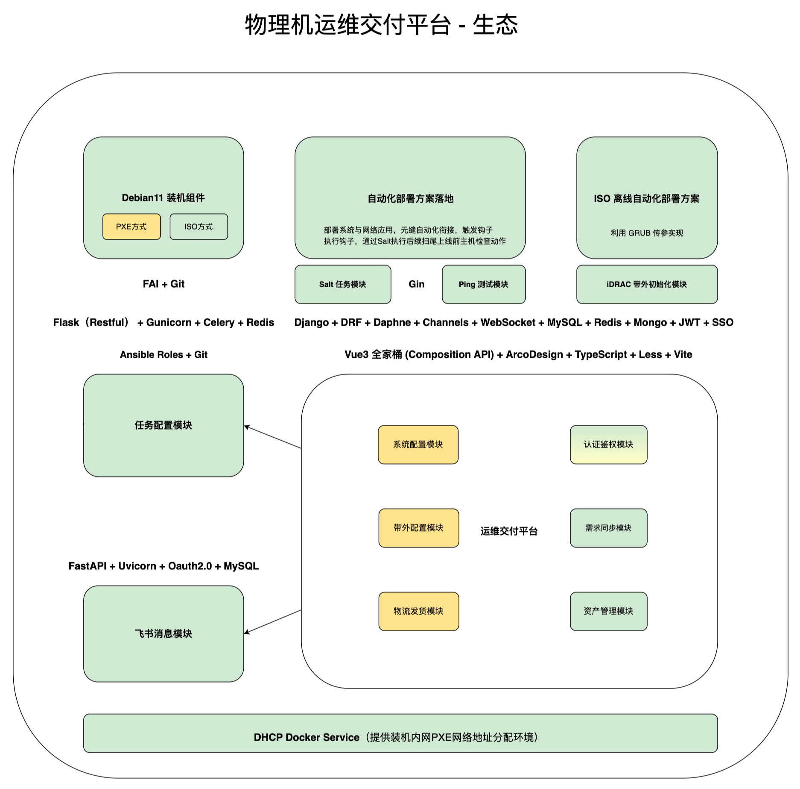
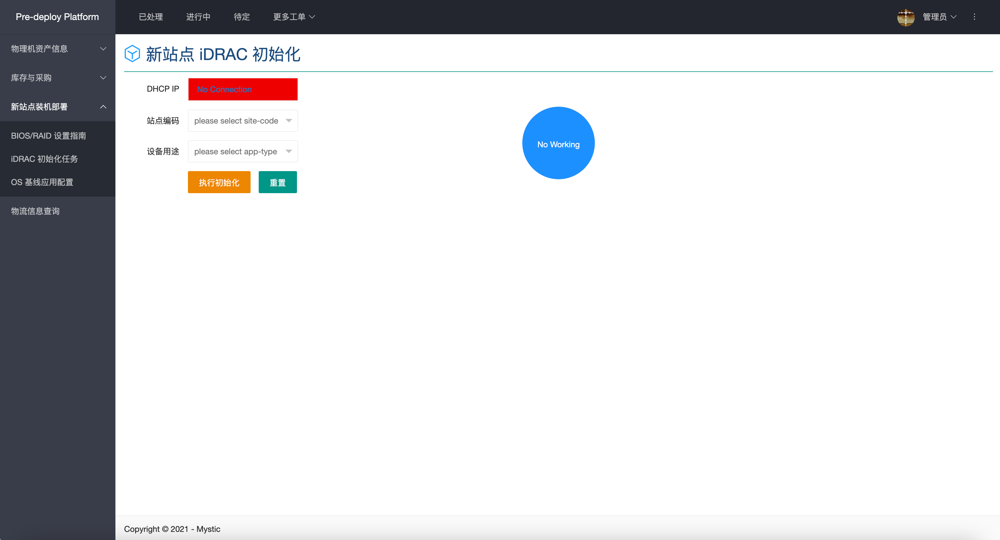
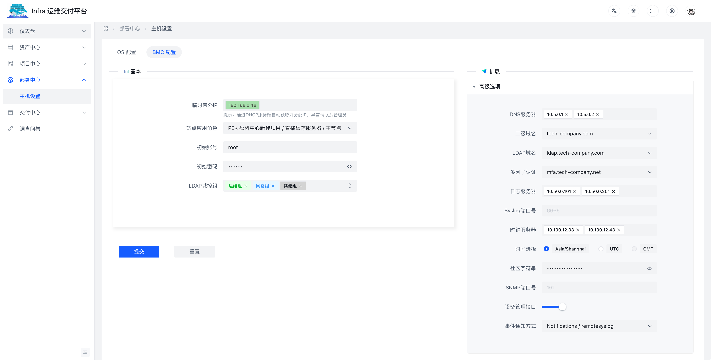

# 平台项目总览

## 目标愿景

- 打造基础设施运维交付平台

## 项目背景

- 业务层面：简单地说，当前交付手段较为传统，运维同学从 “接到工单 -> 确认需求 -> 调拨设备 -> 装机部署 -> 物流发货 -> 关闭工单” 在整个标准化交付 `SOP` 中，依然存在着大量的人工步骤和往复的高沟通成本，举例：

  - 调拨时，可能会出现型号错误，需要重新发货，耽误了项目进度；
  - 装机时，可能会出现配置错误，需求手动修改，或重新安装；
  - 发货后，可能项目经理想要了解当前运单状态，于是每次都需要帮他查询；
  - 盘点时，管理员不清楚当前各型号设备余量，当然也就不知何时该提交 `PR` 采购；

  为一次性解决在交付阶段所产生诸多问题，于是，这个一站式交付平台就这样诞生了。

- 技术层面：前后端不分离 -> 前后端分离，解决业务代码耦合的问题。

## 需求分析

- 根据业务场景及实际运维痛点，开发功能大致可分为以下几个部分：

| 模块     | 描述                          |
| -------- | ----------------------------- |
| 装机部署 | `PXE`/`ISO` 方式 `FAI` 全自动装机 |
| 配置功能 | `OS` 系统配置、`BMC` 初始化配置 |
| 设备交付 | 物流下单、状态追踪、消息订阅 |
| 资产管理 | 实现动态监控、调拨及采购提醒  |
| 资产申请 | 可租借、长期使用物理服务器  |

## 技术选型

静态页面：`HTML5` + `CSS3` + `Flex` +  `Less` + `ECMAScript6+`

前端框架：`VUE3.2` (Composition API) + `TypeScript` + `Arco Design` + `Vite`

后端框架：`Django4` + `DRF` + `Celery` + `ASGI` + `Channels` + `Daphne`

应用组件：`MYSQL` + `MongoDB` + `Redis` + `RabbitMQ`

网络协议：`HTTP` + `WebSocket` + `SSH`

接口风格：`Restful API`

## 身份认证

Web：`SSO` 飞书扫码登录 + `JWT`

OpenAPI：`OAuth2` 密码授权模式 `app_id` & `app_secret` -> `Bearer`/`Basic`

## 技术架构

综合来看，这是一个典型的 `Python` 全家桶 `WEB` 前后端分离项目：

| WEB 框架     | 说明                          |
| -------- | ----------------------------- |
| 同步框架 | `Django` 主项目模块，使用 `ASGI` 开启异步支持；|
| 同步框架 | `Flask` 任务子模块：使用 `Celery` 支持异步任务；|
| 异步框架 | `FastAPI` 消息子模块：支持异步并发消息推送；|

  

## 平台升级

| Platform | Screenshot |
| -- | -- |
| Old | |
| New | |

